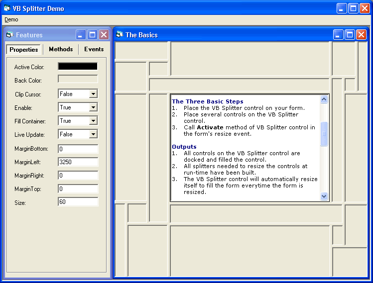



## VB  Splitter

### Description

VB Splitter is a developer-friendly ActiveX control to allow the user to resize docked controls at run-time. You can now have a splitting-capability for any number of controls with only one VB Splitter control and one line of code in your program. The control has 11 properties, 2 methods and 7 events customly made for your pleasure. It's very well-commented and has a strong encapsulation technic that making this control an author-friendly ActiveX control. Just don't miss the demo (open the VB Splitter Demo.vbg). Your feedback and vote will be very appreciated. Thanks in advance.
 
### More Info
 

             |
---                |---
**Submitted On**   |2003-09-12 11:13:28
**By**             |[Theo Z](https://github.com/Planet-Source-Code/PSCIndex/blob/master/ByAuthor/theo-z.md)
**Level**          |Intermediate
**User Rating**    |5.0 (149 globes from 30 users)
**Compatibility**  |VB 6\.0
**Category**       |[Custom Controls/ Forms/  Menus](https://github.com/Planet-Source-Code/PSCIndex/blob/master/ByCategory/custom-controls-forms-menus__1-4.md)
**World**          |[Visual Basic](https://github.com/Planet-Source-Code/PSCIndex/blob/master/ByWorld/visual-basic.md)
**Archive File**   |[VB\_Splitte1644829122003\.zip](https://github.com/Planet-Source-Code/theo-z-vb-splitter__1-48454/archive/master.zip)

